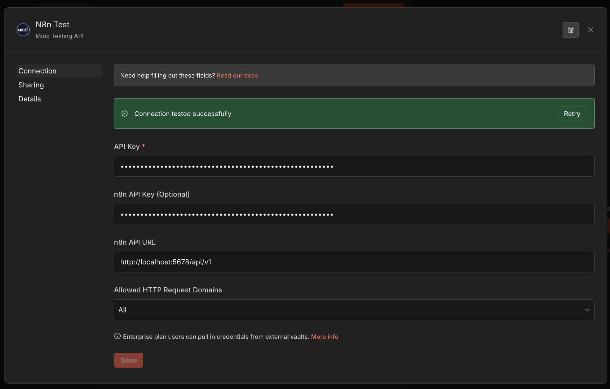
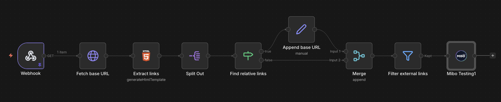
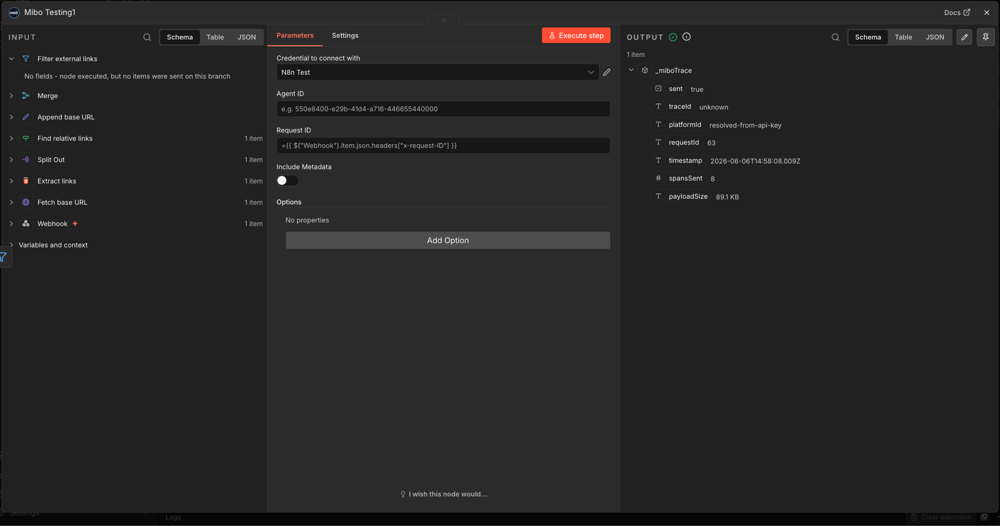

# Quick Start Guide

Get the Mibo Testing node sending traces in about 30 seconds.

## 30-second setup

1. **Install the node** — in n8n, go to **Settings → Community Nodes**, search for `@mibo-ai/n8n-nodes-mibo-testing`, click **Install**.
2. **Add credentials** — create a new credential of type **Mibo Testing API**. Paste your Mibo API key and your n8n API key (Settings → API → Create an API Key, `workflow:read` scope is enough).

   

3. **Drop the node at the end of your workflow** — connect it after the last node you want traced.

   

4. **Run the workflow** — the node passes every input through unchanged and appends a `_miboTrace` summary. Open the Mibo Testing dashboard to see the trace.

   

That's it. No filters, no per-node config, no host-level setup.

## Troubleshooting

### Payload too large

> `Failed to send trace to Mibo Testing: The trace data is too large to send.`

The node has a **10 MB hard limit per trace**. n8n does not let community nodes gzip outgoing HTTP requests, so the JSON payload travels uncompressed and the limit applies to the raw size. You will also see a warning at 8 MB.

Most common cause: one or more nodes return large outputs — files, base64 images, long LLM responses, or full document bodies — and those outputs get serialized into `n8n.node.output`.

Fixes:

- Strip or summarize heavy fields before the Mibo Testing node (a Set or Code node trimming `data`, `image`, `body`, etc. is usually enough).
- Split the workflow so heavy nodes run in a sub-workflow that is not traced.
- Check the `_miboTrace.payloadSize` field in the node output — it tells you exactly how close you are to the limit.

### Wrong node names in the trace

The trace uses the **n8n display name** of each node — the same string shown in the editor. If a Mibo `node_call` assertion does not match, it is almost always because the node was renamed in the editor and the assertion still references the old name.

Fixes:

- Open the workflow in n8n and confirm the exact display name of each node (case and spaces matter).
- Update the assertion in Mibo to match the current display name, or rename the node in n8n to match the assertion.
- Auto-utility nodes (`Sticky Note`, `No Op`, `Wait`, `Manual Trigger`, `Respond to Webhook`, the Mibo Testing node itself) are excluded by design and never appear in the trace.

### API key issues

> `The API key does not exist or has been revoked.`
> `Missing x-api-key header.`
> `Could not determine the target agent.`

The node uses two different API keys and they are easy to mix up:

- **API Key** (required) — your **Mibo Testing** API key, from the Mibo dashboard under Settings → API Keys.
- **n8n API Key** (optional) — your **n8n** instance key, used to read the workflow structure.

Fixes:

- If you see "API key does not exist or has been revoked", you pasted the n8n key into the Mibo field (or the Mibo key was rotated). Re-paste the Mibo API key from the dashboard.
- If you see "Missing x-api-key header", the credential field is empty — re-open the credential and save it again.
- If you see "Could not determine the target agent", either set **Agent ID** on the node, or scope the Mibo API key to a single agent in the dashboard.
- If you see "The API key is restricted to specific agents", the **Agent ID** on the node is not one of the agents the key is allowed to use — update one of them so they match.
